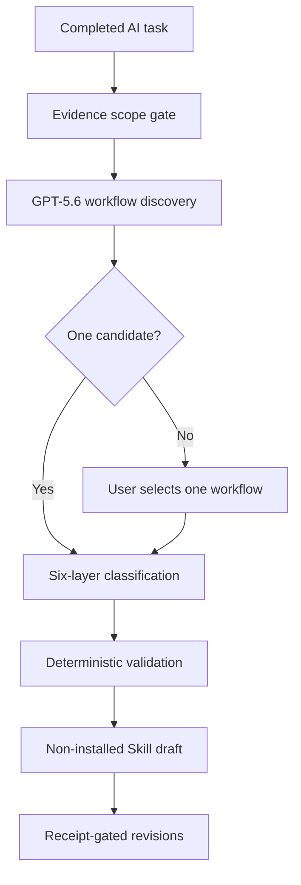

# FlowPrint

**Turn completed AI work into one reusable Agent Skill draft—without recording or replaying the conversation.**

FlowPrint is a Codex plugin that starts after a task is complete. It separates adjacent reusable workflows, asks the user which workflow to preserve, classifies evidence into six reusable layers, and compiles a non-installed Skill draft behind deterministic validation and confirmation gates.

## The problem

Useful AI workflows are usually trapped inside long conversations. Copying the whole conversation into a prompt or memory file creates four problems:

- stable methods get mixed with one-off values;
- named entities and preferences leak into general rules;
- failed attempts and permission boundaries are lost;
- multiple deliverables can be merged into one overly broad Skill.

FlowPrint treats reuse as a small compilation problem rather than transcript storage.

## What FlowPrint does

1. **Scope evidence before discovery.** Broad personal roots such as Home, Downloads, and Desktop fail closed before recursive search.
2. **Discover workflow candidates.** GPT-5.6 in Codex identifies independently reusable purposes or outputs.
3. **Stop for workflow selection.** If more than one candidate exists, FlowPrint emits `needs_workflow_selection` and does not create six-layer items.
4. **Decontextualize the selected workflow.** Evidence is classified into Core Workflow, Domain Knowledge, Profile, Run Parameters, Failure Lessons, and Permission Boundaries.
5. **Validate and compile.** Python validators reject unsupported schema states, forged confirmations, cross-workflow items, and premature compilation.
6. **Revise without overwriting.** Later corrections create an impact plan, invalidate stale state, require fresh confirmation, and compile a separately versioned draft.



## Why it is different

FlowPrint does not save a raw transcript and does not ask the model to assign itself a numerical confidence score. It uses explicit evidence states, review gates, user-bound confirmations, immutable base drafts, and deterministic compiler checks.

The model still performs language understanding. The deterministic layer can prevent a **declared** multi-workflow result from compiling silently; it cannot prove that the model discovered every possible workflow.

## Quick start

### Requirements

- a Codex CLI release that supports plugins and local marketplaces (the documented acceptance runs used `0.144.5` and `0.144.6`)
- Python 3
- macOS or Windows
- a logged-in Codex session

### Install from a local checkout

Clone or extract this repository, then run the following from the repository root.

macOS:

```bash
codex plugin marketplace add "$(pwd)"
codex plugin add flowprint@flowprint-dev
codex plugin list
```

Windows PowerShell:

```powershell
codex plugin marketplace add (Get-Location).Path
codex plugin add flowprint@flowprint-dev
codex plugin list | Select-String "flowprint"
```

If `flowprint-dev` already points to an older checkout, remove that marketplace first and then add the current repository root.

Start a new Codex conversation and run:

```text
$flowprint activation check
```

## Judge test path

The fastest deterministic test uses the included Yueyang fixture. It represents one completed conversation containing two reusable outputs: a family-trip planning workflow and a family invitation/poster workflow.

Validate and render the unresolved classification:

```bash
python3 plugins/flowprint/skills/flowprint/scripts/validate_classification.py \
  tests/fixtures/classification/yueyang-needs-selection-v0.4.json

python3 plugins/flowprint/skills/flowprint/scripts/render_classification.py \
  tests/fixtures/classification/yueyang-needs-selection-v0.4.json
```

Expected state: `needs_workflow_selection`, two candidates, and no six-layer items.

Attempting to compile that unresolved input must fail:

```bash
python3 plugins/flowprint/skills/flowprint/scripts/compile_skill.py \
  tests/fixtures/classification/yueyang-needs-selection-v0.4.json \
  /tmp/flowprint-must-not-exist \
  --skill-name must-not-exist
```

Expected result: exit `1`, gate `workflow_selection`, and no requested output directory.

Then compile either user-selected fixture:

```bash
python3 plugins/flowprint/skills/flowprint/scripts/compile_skill.py \
  tests/fixtures/classification/yueyang-trip-selected-v0.4.json \
  /tmp/flowprint-yueyang-trip \
  --skill-name plan-family-trip
```

The generated manifest remains `not_authorized` for installation and records that no external action occurred.

For the complete Windows PowerShell path, see [`WINDOWS-NODE8-WORKFLOW-SELECTION-TEST.md`](WINDOWS-NODE8-WORKFLOW-SELECTION-TEST.md).

## Run the test suite

```bash
python3 -m unittest discover -s tests -p 'test_*.py' -v
```

Current repository result: **63 tests passed**.

## Current evidence

- plugin installation, activation, positive compilation, and fail-closed rejection were exercised on real macOS and Windows Codex CLI environments across the tested versions;
- one real Windows revision transaction demonstrated stale-state invalidation, confirmation binding, receipt-gated recompilation, and base-draft immutability;
- the current automated suite covers workflow selection, excluded-workflow rejection, evidence scope, compilation, and revision transactions;
- one held-out real sticker task was accepted after two user-guided correction cycles (`N=1`).

The project is **not Field-tested**. The held-out result does not establish statistical classification accuracy, cross-character generalization, or independent-model evaluator agreement.

## How Codex and GPT-5.6 were used

FlowPrint was built inside Codex during OpenAI Build Week. Codex was used to inspect failures, implement the plugin and Python gates, write regression fixtures, run cross-platform acceptance loops, and revise the product after professional review.

GPT-5.6 is also part of the runtime design: it performs evidence interpretation, workflow-candidate discovery, decontextualization, and natural-language correction analysis. Deterministic Python scripts own schema validation, selection and confirmation gates, dependency fingerprints, fail-closed compilation, and revision receipts.

## Repository map

```text
plugins/flowprint/          Plugin and FlowPrint Skill
tests/                      Unit, integration, fixtures, and host evidence
docs/                       Bounded engineering validation records
prove/                      Held-out N=1 evaluation artifacts
submission/                 Build Week submission materials
```

## Supported surfaces

| Surface | Current status |
|---|---|
| macOS Codex CLI | Tested on the documented samples |
| Windows Codex CLI | Tested on the documented samples |
| ChatGPT desktop Work mode | Latest plugin activation and broad-root scope blocking observed on macOS; full Node 8 host demo should be recorded separately |
| ChatGPT web | Local marketplace installation is not supported |

## Limitations

- Workflow discovery depends on model language understanding.
- The evidence base is intentionally small and transparently reported.
- Generated drafts are not automatically installed or described as Field-tested.
- Local receipts protect normal workflow integrity; they are not a defense against a malicious process that can coherently rewrite all local records.
- Judges should evaluate the demonstrated paths, not infer universal accuracy from the included fixtures.

## License

FlowPrint is released under the [MIT License](LICENSE). Copyright © 2026 SIROU Tang.
